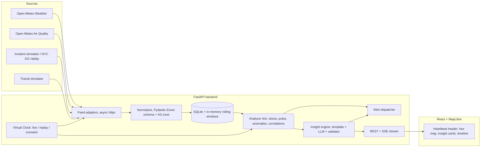

# CityPulse: PRD and 20-Hour Execution Plan

**Track B, AmiHacks · Industry / Open Innovation**
*"One glance should tell a resident what's really happening in their neighborhood, and why it matters."*

**Assumptions:** team of 4 (variants for 2 and 3 in §12), mixed skill level, 20 focused hours (the brief says 24; the extra 4 are buffer), no paid services required.

---

## 0. TL;DR: the decisions at a glance

| Decision | Choice | Why (one line) |
|---|---|---|
| **Data approach** | **Hybrid: real APIs where they exist, simulated where they don't, plus a real-data replay mode** | Live demos die when a Wi-Fi network or API does. Three modes (Live / Replay / Scenario) keep the demo bulletproof and still honest. |
| **Feeds (4)** | Weather (real) · Air quality (real) · 311-style incidents (real replay + synthetic live) · Transit delays (synthetic) | The brief says 3 well-correlated feeds beat 6 unconnected ones. Two are real, two are simulated with deliberately messy formats. |
| **Backend** | **Python + FastAPI**, SQLite, pandas/NumPy, SSE for push | The hard part of this PS is analytics and normalization; Python is the fastest place to do it. |
| **Frontend** | **React + Vite + TypeScript + Tailwind + MapLibre GL + H3 hexes** | Free, no API keys for the map, and gives the custom "heartbeat" visuals that Streamlit can't. |
| **Anomaly detection** | Rolling robust z-score (median/MAD) per feed per zone; IsolationForest as a stretch | Explainable, works with little data, and can be demoed convincingly. |
| **Correlation** | Whitelisted feed pairs, lagged correlation plus co-occurrence in zone and time window, shown as "possible link" with a confidence tier | Meets the "epistemic honesty" constraint by design. |
| **Summaries** | **Template core (always on) + LLM paraphrase (optional) with a number-validator and template fallback** | Grounded strictly in data and never breaks when the LLM rate-limits. |
| **Signature visual** | A city **heartbeat** (ECG line and pulse ring) plus hex heat map plus narrative ticker | Non-cliché, and readable in about 10 seconds. |
| **Deploy** | Single Docker service (FastAPI serves the built frontend); local laptop as primary demo, cloud as backup | One moving part, nothing to wire together at hour 19. |
| **Key architecture trick** | A **virtual clock** shared by live, replay and scenario modes | One analyzer codebase serves every mode, which makes time-warp demos trivial. |

---

## 1. Problem recap and what will be judged

**Problem:** civic signals (weather, transit, air quality, 311 complaints, outages) live in separate silos with different rates, schemas and timestamps. Residents find out about problems after they're in them. City staff can't see clusters until someone escalates.

**Our answer:** ingest multiple feeds, normalize them into one schema, compute a per-zone "pulse", detect anomalies and *possible* links between feeds, and say what's happening in one plain-language sentence.

**The brief's own priority signal:** *"quality of the fusion and the clarity of the resulting summary."* Every design decision below optimizes for those two things, not for feed count or UI flash.

### Traceability: brief requirement → our feature

| Brief requirement | Our feature | Priority |
|---|---|---|
| Ingest 3+ distinct data types | Weather, air quality, incidents, transit (4 feeds) | P0 |
| Normalize and timestamp mismatched feeds | Adapter → Pydantic normalizer → unified `Event` schema, UTC timestamps, H3 zone key | P0 |
| Detect anomalies or correlations | Robust z-score anomalies plus lagged-correlation "possible link" engine | P0 |
| Live, glanceable dashboard or map | Hex heat map, heartbeat header, insight cards, timeline strip | P0 |
| Plain-language summary | Template summary plus grounded LLM paraphrase | P0 |
| Degrade gracefully if a feed is missing | Feed-health tracking, weight renormalization, "reduced confidence" banner | P0 |
| Privacy: no identifying individuals | Aggregate to zones, drop free text, minimum-count display threshold | P0 |
| Understandable in about 10 seconds | Single headline sentence and one status word; ≤3 cards on screen | P0 |
| Epistemic honesty | "Possible link" language, confidence tiers, "why we think so" panel, banned-causal-words validator | P0 |
| Optional: alerting | Discord/Telegram webhook plus in-app toast with cooldown | P1 |
| Optional: historical replay | Real NYC storm-day replay with time-warp scrubber | P1 |
| Innovation: ML anomaly | IsolationForest score alongside rules | P2 |
| Innovation: agentic monitoring | Watcher loop that raises flags with a visible reasoning trace | P2 |

---

## 2. Users and core stories

**Primary: a resident** ("Should I take the underpass tonight? Is the air OK for my kid's football practice?").
**Secondary:** city ops staff (spot clusters early), journalists, responders, small-business owners ("open today?").

| # | Story | Acceptance test |
|---|---|---|
| U1 | As a resident, I open the app and know how my area is doing in ≤10 s | A stranger reads the status word and headline aloud correctly in a test |
| U2 | As a resident, I see *why* it matters, not just a number | Every non-Calm zone has a one-sentence "what and why it matters" |
| U3 | As ops staff, I see when several signals converge in one zone | A multi-feed anomaly card appears with evidence chips per feed |
| U4 | As anyone, I'm told when data is missing or stale | Killing a feed shows an amber chip and a "reduced confidence" note within one refresh cycle |
| U5 | As a skeptic, I can check how a claim was made | "Why we think this" panel shows the data points, window, method, and the "not a confirmed cause" disclaimer |
| U6 | As a presenter, I can replay a past event and watch detection happen | Replay at 60× shows the flag firing before the incident peak |

---

## 3. Scope

**P0 (must ship by hour 15):** 4 feeds normalized; per-zone pulse score; anomaly and correlation engine; live map plus heartbeat header; insight cards; template summaries; feed-health and graceful degradation; scenario engine with time-warp; privacy and honesty guardrails.

**P1 (hours 15–18):** LLM-assisted summaries with validator; NYC real-data replay; alert webhook; timeline strip with lane per feed.

**P2 (only if ahead):** IsolationForest score; agent-lite trace UI; simulated power-outage feed; shareable per-zone link.

**Non-goals:** accounts/login, native mobile app, real transit GTFS-RT integration, prediction beyond a simple "trend rising" indicator, any use of individual-level or social-media user data.

---

## 4. Data strategy: real-time API vs simulated

### 4.1 The decision

| | Real live APIs | Simulated | **Verdict** |
|---|---|---|---|
| Credibility | High | Judges know it's fake | Use real where a free, keyless, global API exists |
| Demo reliability | Weather is calm on demo day → nothing to detect; API/Wi-Fi can fail | Fully controllable | You **must** be able to force an interesting event on cue |
| Correlation proof | Real, but rare and unscheduled | Injected → circular | Real historical replay is the non-circular proof |
| Setup time | Keys, quotas, schema surprises | Total control, but you write generators | Keep generators small (about 100 lines) |
| Schema-mismatch realism | Native mess | You must fake the mess (deliberately!) | Make sim feeds messy on purpose |

**Recommendation: three data modes behind one interface**

1. **LIVE mode:** real weather and air quality for your city from Open-Meteo; simulated incidents and transit whose *baseline* is realistic and whose rates are *optionally* nudged by real weather.
2. **REPLAY mode:** a **real** historical storm day (recommended: NYC, 29 Sep 2023 flash flooding) using Open-Meteo historical weather plus real NYC 311 records, cached locally. This is your honest, non-circular proof that detection works on real data.
3. **SCENARIO mode:** scripted synthetic events ("Storm rolling in", "Smog spike", "Quiet day") for a guaranteed demo, with time-warp (1×, 10×, 60×).

> **Honesty rule (say it out loud in the pitch):** if the simulator couples incident rates to weather, the correlation in Scenario mode is *injected by construction*. Label simulated feeds with a "SIMULATED" badge. The Replay mode on real data is what shows the method works.

### 4.2 Feed catalog

| Feed | Source | Cadence | Format / quirk | Real or sim |
|---|---|---|---|---|
| **Weather** | Open-Meteo Forecast API: `current` and `minutely_15` (rain mm, gusts, weather code) | 15 min | JSON, one point per coordinate (multiple coordinates per call allowed) | **Real** (no key, CORS-friendly, free for non-commercial use; attribute CC BY 4.0) |
| **Air quality** | Open-Meteo Air Quality API: `us_aqi, pm2_5, pm10, nitrogen_dioxide, ozone` | ~hourly | JSON | **Real** |
| **Incidents (311-style)** | Live: synthetic generator. Replay: NYC 311 dataset `erm2-nwe9` via Socrata SODA | Event-driven (irregular) | Live sim: ISO-8601 with timezone offset. NYC: local-time string, lat/lon, complaint type | Sim (live) + **Real** (replay) |
| **Transit delays** | Synthetic route generator | Every 1–2 min | **Epoch seconds**, delay in seconds, route-level (no coordinates; mapped via stop→zone lookup) | Sim |
| *(P2)* Power outages | Synthetic | Every 5 min | Customers-affected counts per polygon | Sim |

**Why simulated feeds must be deliberately messy:** the brief says the difficulty is "differently formatted, differently paced feeds", so your normalizer has to visibly *do work*. Give each sim feed a different timestamp convention, ID scheme and unit (minutes vs seconds) and show the before/after in a "How we fused it" slide.

### 4.3 Verified quick-start calls

```text
# Weather (multi-district: comma-separate coordinates)
https://api.open-meteo.com/v1/forecast?latitude=40.71&longitude=-74.01
  &current=temperature_2m,precipitation,wind_gusts_10m,weather_code
  &minutely_15=precipitation&timezone=UTC

# Air quality
https://air-quality-api.open-meteo.com/v1/air-quality?latitude=40.71&longitude=-74.01
  &current=us_aqi,pm2_5,pm10,nitrogen_dioxide,ozone&timezone=UTC

# Historical weather for replay
https://archive-api.open-meteo.com/v1/archive?latitude=40.71&longitude=-74.01
  &start_date=2023-09-29&end_date=2023-09-29
  &hourly=precipitation,wind_gusts_10m,weather_code&timezone=UTC

# NYC 311 for replay (Socrata SODA). Add an app token if you hit throttling.
https://data.cityofnewyork.us/resource/erm2-nwe9.json
  ?$where=created_date between '2023-09-29T00:00:00' and '2023-09-30T00:00:00'
          AND latitude IS NOT NULL
  &$select=unique_key,created_date,complaint_type,descriptor,latitude,longitude
  &$limit=50000
```

Notes:
- **Run a `GROUP BY complaint_type` first** and pick the storm-relevant types you actually see (likely candidates: Sewer, Water System, Street Condition, Traffic Signal Condition, Damaged Tree). Don't hard-code from memory.
- The NYC 311 dataset is documented as updated daily, so treat it as **replay**, not live.
- **Download once and commit to `/data/replay/`** (CSV/JSON). Never depend on the network during the demo.
- Verify each endpoint returns data in your first hour. If a parameter name differs, the API docs at open-meteo.com and dev.socrata.com are authoritative.
- **Baseline warm-up trick:** at startup, generate 7 days of seeded synthetic history and pull `past_days=2` from Open-Meteo, so rolling baselines exist from second one instead of after hours of waiting.

### 4.4 City and zones

- Put everything in `city.json`: center, zoom, and **6–8 named districts** (name, centroid lat/lon). For NYC, use e.g. 6–8 recognizable neighborhoods.
- **Spatial key = H3 hexagon, resolution 8** (about 0.7 km²). `zone_of(lat, lon)` returns the H3 cell and the nearest named district centroid.
- The map draws hexes colored by stress; summaries speak in district names ("Riverside", not `88283082a3fffff`).
- To demo in a different city: change `city.json`. Live weather and air quality work anywhere; the NYC replay stays as your real-data proof.

---

## 5. System architecture



### 5.1 Tech stack with rationale

| Layer | Choice | Rationale | Rejected alternative (and why) |
|---|---|---|---|
| Language (backend) | Python 3.11+ | pandas/NumPy/scikit-learn for rolling stats; most team members know it | Node: weaker analytics ecosystem |
| Web framework | **FastAPI** + Uvicorn | Async, auto-generated docs (`/docs` is handy for frontend/backend contract), Pydantic built in | Flask: no native async/validation; Django: too heavy |
| HTTP client | `httpx` (async) | Poll several feeds concurrently with timeouts | `requests`: blocking |
| Scheduling | `asyncio` background tasks (or APScheduler) | Simple and inside the same process | Celery/Redis: overkill for 20 h |
| Validation / schema | **Pydantic v2** | The normalizer *is* the schema, and errors are loud | Hand-rolled dicts: silent bugs |
| Storage | **SQLite (WAL mode)** plus in-memory pandas windows | Zero setup, a single file, and replay data is just rows | Postgres/PostGIS: setup time; Redis/Kafka: nothing here needs them |
| Geo | `h3` (Python) and `h3-js` | One shared hex key across feeds, and easy neighbor lookups (`grid_disk`) | Shapely polygons: more code for the same benefit |
| Analytics | pandas, NumPy, SciPy; scikit-learn (P2) | Median/MAD, lagged correlation, IsolationForest | Hand-written stats: slower and riskier |
| Push to UI | **Server-Sent Events** (`sse-starlette`) | One-way push, auto-reconnect, trivial to implement | WebSockets: more code; polling: feels dead, not "live" |
| LLM (optional) | **Gemini Flash / Flash-Lite via Google AI Studio** (free tier, no card) or any equivalent; a local Ollama model as offline backup | Free and fast enough for one-sentence paraphrase | See LLM notes below |
| Frontend | **React + Vite + TypeScript** | Fast HMR and a typed API contract | Streamlit: can't do custom heartbeat/hex animation; Next.js: SSR you don't need |
| Styling | Tailwind CSS | Speed | Custom CSS: slower |
| Map | **MapLibre GL JS** (via `react-map-gl/maplibre`) with a free CARTO dark basemap style | No API token needed; WebGL performance for hex and point layers | Mapbox: token and billing; Leaflet: fine, but weaker for smooth hex/heat layers |
| Charts | Recharts (timeline lanes, sparklines) | Quick to wire in | D3 directly: slow to build |
| Animation | CSS keyframes plus `framer-motion` | Heartbeat pulse and card transitions | Canvas from scratch: unnecessary |
| State | Zustand | Tiny; SSE events push into the store | Redux: boilerplate |
| Packaging | Single Dockerfile: build frontend, FastAPI serves `/dist` | One deployable | Two services: CORS, env vars, cold starts |
| Hosting | Local laptop = primary demo; free-tier PaaS = backup | Free web services often sleep when idle, so ping before the demo | Depending on cloud for the live demo |
| Testing | `pytest` (normalizer, detector, validator) plus a manual QA checklist | Only test what would embarrass you | Full E2E suite: no time |

**Basemap note:** use a free vector style (CARTO Dark Matter or OpenFreeMap) and confirm the style URL loads in hour 1. Keep an attribution badge on the map.

**LLM notes**
- Free-tier quotas for LLM APIs change frequently and have been cut before. Check your live quota in AI Studio and **design as if it will 429**: cache, rate-limit and fall back to templates.
- Free-tier prompts may be used to improve the provider's products. That's fine here because data is public/synthetic. Never send anything private.
- Model choice: a Flash-class model. You don't need a large model to paraphrase a JSON of facts into one sentence.

---

## 6. Unified data model

### 6.1 `Event` (the common schema every feed is normalized into)

```python
class Event(BaseModel):
    id: str                    # "{source}:{native_id or hash}"
    source: Literal["weather","air","incident","transit","outage"]
    ts_utc: datetime           # ALWAYS UTC, timezone-aware
    ingested_at: datetime      # for latency / staleness tracking
    lat: float | None
    lon: float | None
    h3: str | None             # res-8 cell; None only for feed-level data
    district: str | None
    kind: str                  # e.g. "rain_rate", "us_aqi", "sewer", "route_delay"
    value: float | None        # normalized numeric (mm/h, AQI, count=1, delay_min)
    unit: str | None
    severity: float            # 0..1 raw feed-native severity mapping
    label: str                 # short human label, no free text from users
    is_simulated: bool
    raw_ref: str | None        # pointer to raw payload (kept out of UI; no PII)
```

### 6.2 Tables (SQLite)

| Table | Purpose | Key columns |
|---|---|---|
| `events` | Normalized events (all modes) | `id`, `source`, `ts_utc`, `h3`, `district`, `kind`, `value`, `severity`, `mode` |
| `feed_health` | Graceful degradation | `source`, `last_ok_ts`, `status` (ok/delayed/down), `latency_ms`, `expected_interval_s` |
| `pulse_snapshots` | History for timeline and replay | `ts`, `district`, `pulse`, `level`, `components_json` |
| `insights` | What we told the user, and why | `id`, `ts`, `district`, `kind`, `headline`, `body`, `confidence`, `evidence_json`, `method`, `text_source` (template/llm) |
| `alerts_sent` | Dedupe and cooldown | `key`, `ts` |

### 6.3 Normalization rules (the "real data work")

| Problem | Rule |
|---|---|
| Different timestamp formats (ISO with offset, local strings, epoch) | Parse per adapter into UTC-aware `datetime`; reject naive timestamps loudly |
| Different cadences | Resample everything into **5-minute bins** per zone for analytics; keep raw events for the map |
| Different IDs / units | Prefix IDs by source; convert delay seconds to minutes and rainfall to mm/h |
| No coordinates (transit) | Map route/stop to zone via a lookup table in `city.json` |
| Duplicates / late arrivals | Dedupe on `id`; accept late events within a 15-min grace window and re-run the affected bins |
| Missing values | Never impute silently. Mark feed `delayed/down`; exclude it from the pulse and **renormalize weights** |

---

## 7. Analytics engine

All analytics run on a **tick** (every 5 s in demo speed, 30 s in live) using `clock.now()`, so live, replay and scenario modes share one code path.

### 7.1 Per-feed stress (0 = fine, 1 = severe), per zone

| Feed | Stress formula |
|---|---|
| Weather | `max(clip(rain_mm_h / 10), clip((gust_kmh − 40) / 40), alert_level)` |
| Air quality | `clip((us_aqi − 50) / 150)` (AQI 50 → 0, 200 → 1) |
| Incidents | `clip(z⁺ / 4)` where z is the robust z-score of the last-30-min complaint count against that zone's hour-of-week baseline |
| Transit | `clip(0.6·mean_delay_min/15 + 0.4·share_routes_delayed>5min)` |

### 7.2 Pulse score per zone (and city-wide)

```text
weights (base): weather .25 · air .20 · incidents .35 · transit .20
available = feeds with status == ok        # weights renormalized over these
S_mean = Σ(w_f · stress_f) / Σ(w_f)        # over available feeds
S      = max(S_mean, 0.85 · max_f stress_f)  # one severe issue must not be averaged away
pulse  = round(100 · (1 − EWMA(S, α=0.3)))   # smoothing prevents jitter
level  = Calm ≥75 · Watch 50–74 · Strained 25–49 · Alert <25
```
City-wide pulse = population- or incident-weighted mean of zone pulses, floored by the worst zone's level minus one step.

### 7.3 Anomaly detection (P0)

- **Method:** robust z-score, `z = 0.6745 · (x − median) / MAD`, over a trailing 6 h window of 5-min bins.
- **Flag** when `z ≥ 3` for ≥2 consecutive bins; **clear** when `z < 1.5` (hysteresis stops flicker).
- **Cold start:** if fewer than 12 bins, fall back to fixed thresholds and mark confidence "low".
- **Why not just ML?** It's explainable to a non-technical judge, needs no training, and works at hackathon data volumes. Add **IsolationForest** on the per-zone feature vector (P2) as a second opinion shown as "unusual pattern score", not as the primary detector.

### 7.4 Correlation / "possible link" engine (P0)

Only test **domain-plausible pairs** (avoids p-hacking-style spurious links):

| Cause-side feed | Effect-side feed | Story |
|---|---|---|
| Weather | Incidents | Heavy rain → flooding/drain/tree complaints |
| Weather | Transit | Storm → delays |
| Air quality | Incidents | Smoke/smog → odor/air complaints |
| Incidents | Transit (same zone) | Road/signal issues → delays |

For each zone and each whitelisted pair over the last 3 h of 5-min bins:
1. Both feeds are currently anomalous (or one anomalous, one rising) within ±30 min.
2. **Lagged Pearson correlation** for lags 0–6 bins (30 min), requiring n ≥ 24 bins and |r| ≥ 0.6.
3. Spatial check: same zone or a neighbouring hex (`grid_disk`).
4. Temporal precedence bonus: cause-side leads effect-side.

**Confidence tier** (display as words, never percentages that imply false precision):
`Weak signal` (1–2 checks pass) → `Moderate signal` (3 pass) → `Strong signal` (all 4 pass). The top tier is still labeled **"possible link, not a confirmed cause."**

### 7.5 Epistemic-honesty rules (enforced in code, not just in copy)

1. Allowed phrasing: "may be linked to", "coincides with", "possible link". **Banned** in template and LLM output: "caused by", "because of", "due to", "is responsible for" (regex validator; on violation, use the template).
2. Every link shows evidence: feeds involved, window, r-value/lag, event counts, and simulated-vs-real badges.
3. Minimum evidence threshold: never show a link with fewer than 8 supporting events.
4. Show what's *missing*: if a feed is down, the summary says so.
5. "Why we think this" panel on every card (this is your best judging moment).

### 7.6 Privacy rules

- Store only complaint **type**, time and coordinates snapped to the H3 cell. Drop descriptors and any free text.
- Show individual dots only where the zone has ≥3 reports in the window; otherwise show only in aggregate.
- No social-media handles or user IDs anywhere. If you want a "social sentiment" flavor, use a synthetic aggregate counter, clearly labeled.

---

## 8. Insight and summary layer

### 8.1 Structure of every insight

```json
{
  "district": "Riverside",
  "level": "Strained",
  "headline": "Heavy rain and 14 drainage complaints in Riverside in the last 30 min.",
  "why_it_matters": "Low-lying streets and underpasses may flood; allow extra travel time.",
  "link": {"feeds": ["weather","incident"], "signal": "Moderate signal", "lag_min": 15},
  "facts": {"rain_mm_h": 8.2, "incidents_30m": 14, "baseline_30m": 2, "transit_delay_min": 6.5},
  "caveats": ["Possible link, not a confirmed cause.", "Transit feed delayed 4 min."]
}
```

### 8.2 Generation pipeline

1. **Template layer (always on):** deterministic sentences from the `facts` JSON. This is your safety net, and it's already grounded.
2. **LLM layer (P1, optional):** send *only* the `facts`, `caveats` and a style prompt; get one plain-language sentence back.
3. **Validator:** (a) every number in the LLM output must appear in `facts`, (b) no banned causal phrases, (c) length ≤ 30 words, (d) mentions any relevant caveat. **Fail → use the template.**
4. **Cache and rate-limit:** key = `hash(district, level, facts-rounded)`; at most 1 call per district per minute, only for the top 3 zones.

```text
SYSTEM: You rewrite structured civic data into ONE plain-English sentence (max 28 words)
for a non-technical resident. Use ONLY the numbers and facts in the JSON. Never state or
imply a confirmed cause; use "may be linked to" or "coincides with". If caveats exist,
mention the most important one briefly. Output the sentence only.
```

### 8.3 Agent-lite (P2)

Frame it honestly: an **event-driven watcher loop** that checks triggers each tick, decides which flags to raise (dedupe, cooldown, escalation), and logs a *reasoning trace* shown in the UI ("Checked 8 zones · 2 anomalies · 1 whitelisted pair passed · flag raised for Riverside"). Only call it a tool-using LLM agent if the LLM actually chooses tools.

### 8.4 Alerts (P1)

- Trigger: zone level drops to `Alert`, or any `Strong signal` insight.
- Delivery: in-app toast plus **Discord webhook or Telegram bot** (one HTTP POST, works in a live demo on a phone).
- Guardrails: 10-minute cooldown per zone, dedupe key, includes the "possible link" wording.

---

## 9. UX / UI specification

### 9.1 The 10-second rule

A first-time viewer should get, in order: **(1) a status word** (Calm/Watch/Strained/Alert) → **(2) one headline sentence** → **(3) where** (highlighted hexes on the map). Everything else is progressive disclosure.

### 9.2 Layout (desktop; stacks vertically on mobile)

```text
┌───────────────────────────────────────────────────────────────────────┐
│ ♥ CITY PULSE  [ heartbeat ECG ~~^~~~^~~ ]  STRAINED · 41              │
│ "Heavy rain and 14 drainage complaints in Riverside. Allow extra time." │
├──────────────────────────────────────────────┬────────────────────────┤
│                                              │  WHAT'S HAPPENING      │
│           HEX HEAT MAP (MapLibre)            │  ▸ Riverside · Strained│
│      pulsing hexes, incident dots (≥3)       │    [🌧][📣][🚌] Possible│
│      click hex/district → detail drawer      │    link · Moderate     │
│                                              │    Why we think this ▾ │
│                                              │  ▸ Old Town · Watch    │
├──────────────────────────────────────────────┴────────────────────────┤
│ TIMELINE (last 6 h): lanes per feed, anomaly markers, scrubber ▶ 60×  │
│ Feed health: 🌧 ok · 🌫 ok · 📣 SIM · 🚌 SIM/delayed 4m               │
└───────────────────────────────────────────────────────────────────────┘
      Narrative ticker (bottom, scrolling recent insights)
```

### 9.3 Pulse metaphor (your non-cliché differentiator)

- **Heartbeat header:** an ECG line whose **rate and irregularity** map to city stress (calm = slow, steady; alert = fast, jagged) plus a soft glow ring in the level colour.
- **Hexes:** breathe at a rate proportional to zone stress. The metaphor reads instantly without a legend.
- **Ticker:** timestamped one-liners in plain language ("18:42 · Rain intensifying near Riverside").
- Keep animations at ≤60 fps and honor `prefers-reduced-motion`.

### 9.4 Design system

- **Level palette (colour-blind-safe; never rely on colour alone, always pair with the status word and an icon):** Calm teal · Watch yellow · Strained orange · Alert magenta-red on a dark background.
- Typography: one clean sans (e.g. Inter) plus a mono for numbers; big type for the status word.
- Copy rules: sentences ≤ 25 words, no jargon ("anomaly" → "unusual"), no "z-score" outside the "Why" panel.
- Empty/quiet state matters: "All quiet. Here's what we're watching" with the feed health chips (this is what judges will see first if nothing is happening).

### 9.5 Demo control panel (hidden behind `?demo=1`)

Scenario buttons (Storm / Smog / Quiet), time-warp (1× / 10× / 60×), "Kill feed" toggles per source, Replay picker, "Trigger alert" test.

---

## 10. API contract (agree on this in hour 1, and build a mock server from it)

| Method & path | Purpose | Notes |
|---|---|---|
| `GET /api/state` | Full snapshot: city pulse, per-district pulse/level/components, feed health, active insights | Called on load and reconnect |
| `GET /api/stream` (SSE) | Push: `pulse`, `insight`, `feed_health`, `event` (aggregated), `alert` | Auto-reconnect via `EventSource` |
| `GET /api/timeseries?district=&source=&window=6h` | Binned series for timeline and sparklines | 5-min bins |
| `GET /api/insights?since=` | Insight history | Feeds the ticker |
| `GET /api/insights/{id}/explain` | Evidence for "Why we think this" | method, window, r, lag, counts |
| `POST /api/demo/scenario` | `{name: "storm"\|"smog"\|"quiet", speed: 1\|10\|60}` | Demo only |
| `POST /api/demo/feed` | `{source, mode: "ok"\|"delayed"\|"down"}` | Proves graceful degradation |
| `POST /api/replay` | `{dataset: "nyc_2023_09_29", speed}` | Switches the virtual clock |
| `GET /api/health` | Liveness | For the deploy platform |

SSE payload example:
```json
event: pulse
data: {"ts":"2026-09-24T12:40:00Z","city":{"pulse":41,"level":"Strained"},
       "districts":[{"name":"Riverside","pulse":33,"level":"Strained",
       "components":{"weather":0.8,"incident":0.7,"transit":0.4,"air":null}}]}
```
(`null` component = feed unavailable, so the UI shows a grey segment rather than a zero.)

---

## 11. Repository structure

```text
citypulse/
├─ city.json                      # center, districts, stop→zone map, weights
├─ backend/
│  ├─ app/
│  │  ├─ main.py                  # FastAPI app, SSE, static serving
│  │  ├─ clock.py                 # LiveClock / VirtualClock (time-warp)
│  │  ├─ models.py                # Pydantic Event, Insight, etc.
│  │  ├─ db.py                    # SQLite helpers
│  │  ├─ geo.py                   # zone_of(lat,lon), h3 helpers
│  │  ├─ adapters/
│  │  │  ├─ weather.py  air.py    # Open-Meteo (real)
│  │  │  ├─ incidents_sim.py  transit_sim.py
│  │  │  └─ nyc311_replay.py      # loads cached CSV/JSON
│  │  ├─ normalize.py             # per-source → Event
│  │  ├─ analyze/
│  │  │  ├─ stress.py  pulse.py  anomaly.py  correlate.py
│  │  ├─ insights/
│  │  │  ├─ templates.py  llm.py  validate.py
│  │  ├─ alerts.py                # webhook dispatcher w/ cooldown
│  │  └─ scenarios.py             # storm / smog / quiet scripts
│  ├─ tests/                       # normalize, anomaly, validator
│  └─ requirements.txt
├─ frontend/
│  ├─ src/ (components: PulseHeader, HexMap, InsightCards, Timeline,
│  │       FeedHealth, WhyPanel, DemoPanel; store.ts; api.ts; types.ts)
│  └─ vite.config.ts
├─ data/replay/                    # cached NYC 311 + weather for the storm day
├─ Dockerfile  ·  README.md  ·  .env.example
```

---

## 12. The 20-hour plan

### 12.1 Roles (team of 4)

| Role | Owns |
|---|---|
| **P1: Data/Backend lead** | Adapters, normalizer, SQLite, virtual clock, SSE, deploy |
| **P2: Analytics/AI lead** | Stress, pulse, anomaly, correlation, insights, LLM, validator, alerts |
| **P3: Frontend lead** | Map, hexes, heartbeat, cards, timeline, feed-health UI |
| **P4: Simulation/Design/Story** | Simulators and scenarios, design system, copy, test data, demo script, slides, video backup |

**Team of 3:** merge P4's sim work into P1 and design/pitch into P3. **Team of 2:** one backend+analytics, one frontend+design; drop P1/P2 items: LLM layer, replay, alerts (do templates only) and keep scenario mode.

### 12.2 Timeline

| Hours | Milestone | Deliverables and checkpoint |
|---|---|---|
| **0–1** | **Lock and align** | Decide city, districts, 4 feeds. Repo and CI-free setup. Agree `Event` schema and API contract (§6, §10). P1 spins up FastAPI with a **mock `/api/state` + `/api/stream`** so P3 is unblocked. Verify Open-Meteo, Socrata and basemap URLs actually respond. |
| **1–4** | **Ingest and normalize** | P1: weather and AQ adapters, SQLite, normalizer, feed-health tracking. P4: incident and transit simulators (messy formats!) plus 7-day seeded baseline. P3: map with hexes fed by mock data, layout skeleton. P2: stress formulas and rolling-bin utilities with unit tests. **✔ Checkpoint H4: real weather and AQ flowing into `events`; map shows mock hexes.** |
| **4–8** | **Analyze and connect** | P2: pulse score, anomaly detector, SSE `pulse` events. P1: virtual clock plus scenario engine (storm script). P3: connect to real SSE; pulse header; hex colours from real pulse. P4: design tokens, copy rules, template sentences. **✔ Checkpoint H8: trigger "storm" scenario → hexes change colour end-to-end.** |
| **8–12** | **Correlate and explain** | P2: correlation engine, insight objects, template summaries, `/explain`. P3: insight cards, "Why we think this" panel, timeline lanes. P1: time-warp controls, feed kill toggles. P4: write the demo script, prepare scenario tuning. **✔ Checkpoint H12: full P0 demo path works from the demo panel.** |
| **12–15** | **Trust and polish** | Graceful degradation everywhere (kill-feed drill). Heartbeat animation and ticker. Privacy thresholds. Empty/quiet state. Banned-phrase validator. Fix bugs found by P4 running the checklist (§14). **🔒 Feature freeze at hour 15 for P0.** |
| **15–18** | **P1 features** | LLM summary plus validator plus cache. NYC replay (cache data, replay picker, scrubber). Alert webhook. Optional P2 items **only if P0 is stable**. |
| **18–19** | **Package** | Dockerfile, README (setup and architecture diagram), cloud backup deploy, `.env.example`, **screen-record a 2-min backup demo video**. Full-system failure drills (§13.3). |
| **19–20** | **Rehearse** | 3 full run-throughs of the pitch with a stopwatch. Buffer for fires. **No new code after hour 19 except fixes.** |

### 12.3 Cut lines (if you're behind)

1. Drop P2 (ML, agent-lite, outage feed).
2. Drop LLM: **template-only is completely acceptable** and safer.
3. Drop alerts.
4. Drop NYC replay but keep Scenario mode (it already shows the detection story).
5. Never drop: normalization, graceful degradation, "possible link" honesty panel, the heartbeat header, the demo control panel.

### 12.4 Working agreements

- **Contracts first, mocks second, integration third.** No one waits for anyone after hour 1.
- Merge to `main` every 2 hours; run the app end-to-end at every checkpoint.
- One person owns the demo script and says "no" to scope creep after hour 15.

---

## 13. Demo and pitch plan

### 13.1 Three-minute narrative

| Time | Beat | What's on screen |
|---|---|---|
| 0:00 | **Hook:** "Your neighbourhood's data exists, but in six different apps." | Static image of the silos |
| 0:20 | **Glance:** open CityPulse in Calm state; ask the audience to read it in 10 s | Heartbeat steady, "Calm · 84" |
| 0:40 | **Storm scenario** (60×): rain builds, complaints cluster, transit slows | Heartbeat quickens; Riverside hexes pulse orange |
| 1:20 | **Fusion:** open the insight card and *Why we think this* | Evidence, lag, "possible link, not confirmed cause" |
| 1:50 | **Real-data proof:** switch to NYC replay of 29 Sep 2023 | Detection fires before the peak on real weather and 311 data |
| 2:20 | **Resilience:** kill the transit feed | Amber chip, "reduced confidence", summary still works |
| 2:40 | **Trust and impact:** privacy aggregation, honesty rules, alert on phone | Discord/Telegram message arrives |
| 2:55 | **Close:** "One glance. One sentence. Honest about what we don't know." | Pulse header |

### 13.2 Likely judge questions (prep answers)

- *"Is this real data?"* Weather and air quality are live and real. Replay is real NYC data. Live incidents and transit are labeled simulated because free citywide feeds don't exist; the replay shows the method works on real data.
- *"Isn't correlating simulated feeds circular?"* Yes in Scenario mode, and we say so; that's why Replay exists.
- *"How do you avoid false causation?"* Whitelisted pairs, minimum evidence, tiered wording, banned causal phrasing enforced in code, and an evidence panel.
- *"What if the LLM hallucinates?"* It only sees a facts JSON; a validator checks every number and falls back to templates.
- *"How would this scale to a real city?"* Adapter pattern, so each real feed is one file; H3 zones; move SQLite → Postgres/TimescaleDB and SSE → a message broker.

### 13.3 Failure drills (do these at hour 18)

Wi-Fi off · Open-Meteo unreachable · LLM 429 · backend restart mid-demo (does the UI reconnect?) · projector resolution 1280×720 · phone as second screen.

**Backups:** local run is primary; deployed URL secondary; 2-min recorded video tertiary; screenshots in the slides last.

---

## 14. QA checklist (P4 runs this at hours 8, 12, 15, 18)

- [ ] Status word plus headline are understandable by a non-team member in ≤10 s
- [ ] Killing each feed individually never crashes the UI or backend, and shows the amber chip
- [ ] All timestamps in UTC internally; displayed in the city's local time
- [ ] No banned causal words anywhere (search the codebase and the LLM output logs)
- [ ] No individual-level data or free text in DB or UI
- [ ] Simulated feeds always carry a SIMULATED badge
- [ ] Scenario "Quiet" produces **no** false alerts over a 10-minute run
- [ ] Replay run is deterministic (same result twice)
- [ ] Backend reconnect: restart server, UI recovers without refresh
- [ ] Works on a laptop at 1280×720 and on a phone-width viewport
- [ ] Colour-blind check (status word and icon always present)

---

## 15. Risks and mitigations

| Risk | Likelihood | Impact | Mitigation |
|---|---|---|---|
| Demo-day weather is boring | High | High | Scenario mode plus cached Replay |
| Wi-Fi/API outage on stage | Medium | High | Local run, cached replay data, sim fallbacks, recorded video |
| LLM rate-limit / quality | Medium | Low | Template-first, validator, cache, "LLM optional" |
| Sim looks fake | Medium | Medium | Messy formats, SIMULATED badge, real Replay as proof |
| Spurious correlations | Medium | High (honesty) | Whitelist pairs, min-n, tiers, disclaimers, permutation-test stretch |
| Frontend/backend integration delay | Medium | High | Mock server from hour 1; contract in `/docs` |
| Scope creep | High | High | Freeze at H15, cut lines (§12.3) |
| Map style/tiles fail | Low | Medium | Test at hour 1; keep a second free style URL as fallback |
| Cold start / sleeping free host | Medium | Medium | Local primary; ping before demo |
| Team burnout | High | Medium | Sleep rota; nobody codes after H19 |

---

## 16. Constraint compliance (from the brief §7)

| Constraint | How we comply |
|---|---|
| Public or synthetic data only | Open-Meteo, NYC Open Data, self-generated simulators |
| Degrade gracefully if a feed is missing | `feed_health`, weight renormalization, grey/amber UI states, kill-feed demo toggle |
| No identifying individuals | Aggregation to H3, drop free text, ≥3 threshold for dots |
| Understandable in ~10 s | Status word, one headline, three cards max |
| Epistemic honesty | "Possible link" language, confidence tiers, evidence panel, banned-phrase validator |

---

## 17. Stretch ideas (only after P0/P1 are stable)

1. **Permutation test:** shuffle one series 200× to show how often a correlation that strong appears by chance (great honesty story).
2. **IsolationForest** "unusual pattern" score per zone.
3. **Trend arrow:** "rising / steady / easing" using a simple slope on the last 30 min (a light form of "predictive").
4. **Simulated power-outage feed** and a classic "outage plus signal down" story.
5. **Shareable zone link** (`?zone=riverside`) for the resident use case.
6. **Business mode:** "Should I open today?" one-line verdict from pulse and forecast.

---

## 18. Appendix: minimal skeletons

### 18.1 Robust anomaly check

```python
import numpy as np

def robust_z(series: np.ndarray, x: float) -> float:
    med = np.median(series)
    mad = np.median(np.abs(series - med)) or 1e-6
    return 0.6745 * (x - med) / mad

def is_anomalous(recent_bins, history_bins, thresh=3.0, consec=2):
    zs = [robust_z(history_bins, b) for b in recent_bins[-consec:]]
    return len(zs) == consec and all(z >= thresh for z in zs)
```

### 18.2 Virtual clock (one interface, three modes)

```python
class Clock:
    def now(self) -> datetime: ...
class LiveClock(Clock):
    def now(self): return datetime.now(timezone.utc)
class VirtualClock(Clock):
    def __init__(self, start, speed=1.0): self.start, self.speed, self._t0 = start, speed, time.monotonic()
    def now(self): return self.start + timedelta(seconds=(time.monotonic()-self._t0)*self.speed)
    def set_speed(self, s): ...   # re-anchor start/_t0 then update speed
```

### 18.3 Number-grounding validator

```python
import re
BANNED = re.compile(r"\b(caused by|because of|due to|is responsible for|resulted from)\b", re.I)

def validate(text: str, facts: dict) -> bool:
    if BANNED.search(text) or len(text.split()) > 30:
        return False
    allowed = {str(round(v, 1)).rstrip("0").rstrip(".") for v in facts.values() if isinstance(v, (int, float))}
    nums = re.findall(r"\d+(?:\.\d+)?", text)
    return all(n in allowed or n in {"1","2","3"} for n in nums)  # tune tolerance
```

### 18.4 Simulator sketch (incident generator with a scenario boost)

```python
def incident_rate(district, hour, scenario) -> float:      # events per 5 min
    base = BASE[district] * DIURNAL[hour]                   # seeded, realistic baseline
    boost = scenario.multiplier(district, clock.now())      # e.g. 6x in Riverside during storm
    return base * boost
n = np.random.poisson(incident_rate(...))                   # Poisson arrivals
```

---

*Sources to bookmark: open-meteo.com/en/docs (weather, air quality, historical), dev.socrata.com (SODA queries), maplibre.org, h3geo.org, fastapi.tiangolo.com.*
